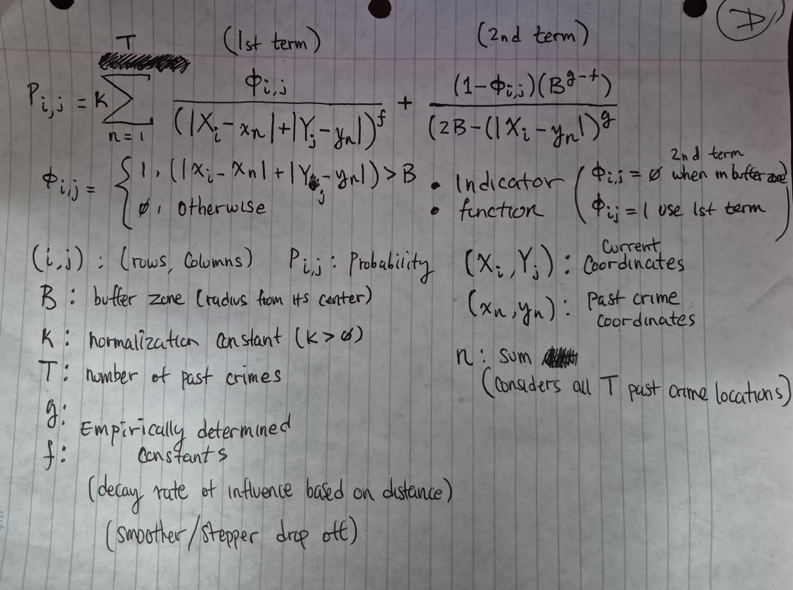

# Implementation of Rossmos Formula 

A plain implementation of the [Rossmos Formula](https://en.wikipedia.org/wiki/Rossmo%27s_formula). Posted a reference image as a reminder of how the formula works.

## Source Files
There are two files: [grid.h](grid.h) and [grid.c](./grid.c)

**grid.h**

**grid.c**

*Baseline to help further implementations*
